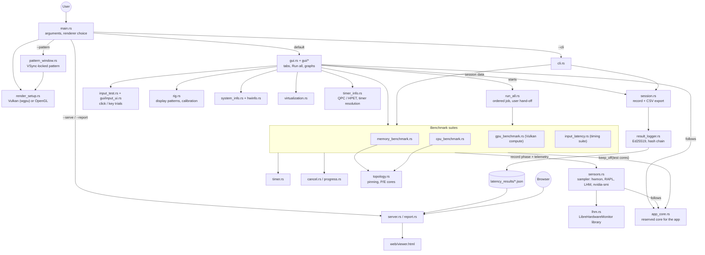

# Latency Tester Suite

Cross-platform (Windows / Linux) latency benchmarks written in Rust, with an egui GUI and a headless CLI.

| Suite  | What it measures |
|--------|------------------|
| Memory | Sequential / random / strided / pointer-chase / stream (copy, scale, add, triad) access, 1–N threads, latency + bandwidth + percentiles |
| CPU    | Integer, float, vector, crypto-like, mixed, compile-sim and game-sim workloads with core affinity (all / P-cores / E-cores / single / HT pairs) |
| GPU    | Vulkan compute dispatch latency and throughput. The SPIR-V shader is generated at run time and its output is verified against a CPU reference |
| Input  | Interactive click-reaction test (GUI), plus timer resolution, timing jitter and loop-polling checks. The headless input checks measure the OS timing/scheduling stack, not real hardware |

Results are signed (Ed25519 over canonical JSON), verified, exported to CSV, and bundled into signed packages.
Editing is detectable and discouraged at several levels:

- Every record carries an Ed25519 signature; anyone can verify it with just the public key (`--cli` prints it).
- Records are hash-chained, so editing, deleting, inserting or reordering entries in the master log fails "Verify Entire Log".
- Saved result files and the signing key are written read-only (key `0400` on Unix).

Limit: the signing key lives on the machine that ran the test, so someone with full access to that machine
could still generate a new key and re-sign. Verify against a public key you recorded earlier or received
separately; stronger guarantees would need an external timestamping/signing service.

## Build & run

One step (needs [Rust](https://rustup.rs)):

| | Build | Run the GUI |
|---|---|---|
| Windows | `build.bat` → `dist\LatencyTester.exe` | double-click the exe, or `run.bat` |
| Linux   | `./build.sh` → `dist/latency-tester` | `./run.sh` |

The exe carries its own icon and version info (`assets/icon.svg` is the source, `assets/icon.ico` is embedded by
`build.rs`; the resource compiler `rc.exe` comes with the Windows SDK that the Rust MSVC toolchain needs anyway, and
without it the build simply continues without the icon).

The exe is self-contained: the MSVC runtime is linked statically, the Vulkan loader is
optional (loaded at run time; the GPU suite reports "no device" without it), and results are
written to a `latency_results` folder next to the exe. Copy the single file anywhere to use it.

Command line (also works on the built exe):

```sh
latency-tester --cli                       # quick headless pass of all suites
latency-tester --cli --skip gpu --out ./my_results
```

Linux GUI needs `libxkbcommon`, X11/Wayland and OpenGL. The GPU suite needs a Vulkan driver
(software drivers such as Mesa lavapipe work: `VK_ICD_FILENAMES=/usr/share/vulkan/icd.d/lvp_icd.json`).

## Run all tests

**▶ Run all tests…** in the title bar opens the plan on the Dashboard; **▶ Run all tests** starts it. The app then

1. collects the system data and waits 10 s (a prompt tells you the first test needs you),
2. runs the **mouse-click and key-press trials first**: wait for the screen to turn green, click / press (10 trials
   each, about a minute). Everything after that runs by itself, so you can walk away. *Skip the click / key tests* in the
   bar above skips them,
3. runs the input timing tests (timer, jitter, polling; unpinned and on every core), then **memory** (all 18 buffer
   sizes, all 14 access patterns, every thread count up to your logical CPUs, 10 runs, 1 warm-up run, 5 s limit per
   test), **CPU** (all 12 workloads on all cores, 10 s runs × 10 with 10 s warm-up, then each core on its own with
   short runs: 2 s × 3, 1 s warm-up, so 12 workloads × 24 cores take about 35 min instead of 9 hours) and
   **GPU** (six sizes, each dispatched for at least 2 s so the load registers),
4. signs and saves one record (`latency_results/…_session_….json`), writes a folder
   `latency_results/run_all_<date_time>/` with `memory.csv`, `cpu.csv`, `gpu.csv`, `input_timing.csv`,
   `input_trials.csv`, `sensors.csv`, a self-contained `report.html` and a short `summary.txt`, and shows everything in
   **Results & Graphs**.

The full profile takes **about an hour** on a 24-thread CPU (the panel shows a typical and a worst-case time
before you start, and every number, including the per-core CPU timings, can be changed). Use **Quick check** for a
few-minute pass or untick parts. *Every core on its own* for memory is off by default because it adds thousands of
tests. **Stop** ends the run early and still saves and exports what finished; a step that fails (for example no
Vulkan device) is noted and the run carries on. Each progress panel stops counting as soon as its suite has ended,
so the tab you look at always shows the step that is really running.

The manual tabs use the same defaults (memory: 10 runs, 1 warm-up, 5 s limit; CPU: 10 s runs × 10, 10 s warm-up, all
workloads), and every suite can still be run and saved by hand.

## Units and short runs

- Every time is saved in **nanoseconds** (memory, CPU) or as 64-bit floating-point milliseconds (GPU, input), so no
  resolution is lost. The web report shows all time columns and charts in one unit you pick at the top of the page
  (ns by default, µs or ms), so every run and every test can be compared directly.
- Small memory buffers are measured with repeated passes: a timed run keeps passing over the buffer until it lasts
  at least 50 µs, and the time is reported per pass (`passes_per_run` in the results). One pass over a small buffer
  takes nanoseconds, so on its own the timer read, a TLB miss or an interrupt could decide the result (for example a
  128 KB StridedRead with a 4 KB stride used to show 255 ns per access in one of three runs; it now measures
  about 1 ns every time).

## What the memory and CPU tests measure

- **Sequential read / write / read-write and STREAM scale / add / triad** work on 64-bit words, compiled twice and
  picked at run time: AVX2 when the CPU has it, SSE2 otherwise. They used to go byte by byte, which capped every
  size (even L1) at the same ~10 GB/s, so they showed the loop, not the memory. STREAM add is `a = a + b` and triad
  `a = a + k·b` over two buffers: the same 2 reads + 1 write per element as STREAM's three-array versions.
- **Pointer chase** carries on from where the previous pass stopped, so a 1 GB buffer is walked through instead of
  the same 65 536 lines being revisited (they then sat in L3, and "1 GB" reported cache latency). With several
  threads each starts at its own point of the cycle. **Dependent read** does the same along its sequential chain.
- Threads split a buffer on **cache-line boundaries**, so no two threads write the same line (false sharing made
  4 KB with 24 threads look several times slower). The second STREAM buffer starts half a page after the first,
  so `src[i]` and `dst[i]` never share a position within a 4 KB page (4K aliasing halved StreamCopy at one size).
- **CPU integer workloads** keep the value in a register between steps. `std::hint::black_box` stored it to the
  stack and loaded it back each time, so IntegerAdd measured store-to-load forwarding: on Arrow Lake the P-cores
  came out 5× slower than the E-cores.
- Results are compared per core type: the Results tab and the report flag a core only against the median of its
  own kind (P with P, E with E), and label cores "Core 10 · P" / "Core 2 · E". P and E cores are read from what
  the OS reports (Windows: each core's efficiency class; Linux: `cpu_core` / `cpu_atom`), CPUID only as a fallback.
- All-core runs next to per-core runs get their own line and slot left of core 0 in the charts, and the chart starts
  on *Throughput per thread* so they can be compared with single cores (the total stays in the table).

## Choosing what to test

Every tab shows live progress (what is running right now, ETA) and fills its results in as tests finish;
**Stop** keeps whatever already finished.

- **Cores** (Memory, CPU, Input): all / P-cores / E-cores / P+E pinned / any specific cores, plus
  **Test each core on its own** to find slow, hot or faulty cores. The Results tab flags cores that are
  well below the median.
- **Memory**: pick buffer sizes, access patterns, thread counts (presets or a custom number), runs per
  test and a time limit per test.
- **CPU**: pick workloads, thread count (all selected cores or an exact number), run length and repeats.

## Sensors and graphs

While any test runs, a background sampler records every sensor it can find twice a second, and each
result stores a summary of the readings taken during that test (CPU temperature max/avg, hottest, coolest
and average core, clocks, load, CPU package power, RAM, GPU temperature/load/power/VRAM). Every test is
also recorded as a *phase*, so the timeline shows which test was running when.

| Reading | Linux | Windows |
|---|---|---|
| CPU temperature (package / per core) | hwmon (`coretemp`, `k10temp`) | LibreHardwareMonitor library next to the exe, or the LibreHardwareMonitor / OpenHardwareMonitor app through WMI; otherwise a package-level ACPI thermal zone |
| Board: VRM, chipset, system temps, fans, voltages | hwmon (`nct67xx`, `it87`, …) | LibreHardwareMonitor |
| Memory (DIMM) temperatures | hwmon (`spd5118`, `jc42`) | LibreHardwareMonitor |
| Drive temperatures | hwmon (`nvme`, `drivetemp`) | LibreHardwareMonitor |
| Power: CPU package, DRAM, PSU | RAPL energy counters (root), PSU hwmon drivers (`corsair-psu`, `nzxt`) | LibreHardwareMonitor (CPU package power; PSU on supported models) |
| CPU clocks / load / RAM | yes | yes (real clocks from `% Processor Performance`) |
| GPU temp / load / power / VRAM | `nvidia-smi` or amdgpu sysfs | `nvidia-smi` (ships with the NVIDIA driver) |

**LibreHardwareMonitor on Windows.** `build.bat` downloads the official
[LibreHardwareMonitor](https://github.com/LibreHardwareMonitor/LibreHardwareMonitor) release (MPL-2.0) into
`dist\LibreHardwareMonitor\`, and the Dashboard has a *Download / Update LibreHardwareMonitor* button for an exe
that was copied elsewhere. The app loads the library itself, so the LibreHardwareMonitor program does not have to
run. Three things have to be in place, and the Dashboard's sensor notes say which one is missing:

1. **The .NET Framework build.** Releases ship `LibreHardwareMonitor.zip` (.NET Framework) and
   `LibreHardwareMonitor.NET.10.zip`; Windows PowerShell, which hosts the library, can only load the first. The
   download picks it, replaces anything that was in the folder and checks that it loads. (Before 1.1 the script
   could pick the .NET 10 build, and then no sensor appeared: press *Update LibreHardwareMonitor* once.)
2. **The PawnIO driver.** Since LibreHardwareMonitor 0.9.5 the CPU (core temperatures, clocks, power), board
   (Super I/O: VRM, fans, voltages) and memory (SPD) sensors are read through [PawnIO](https://pawnio.eu).
   *Install PawnIO* on the Dashboard runs the PawnIO setup that ships inside `LibreHardwareMonitor.exe`, the same
   way LibreHardwareMonitor does on its first start (or start `dist\LibreHardwareMonitor\LibreHardwareMonitor.exe`
   once and accept its prompt). Without it only GPU and drive sensors appear.
3. **Administrator rights:** use *Restart as administrator* on the Dashboard.

Per-core sensors are placed on the right logical CPU: LibreHardwareMonitor names hybrid cores "P-Core #3" /
"E-Core #1", which on Arrow Lake are CPU 10 and CPU 2 (P and E cores are interleaved). Its per-core clocks replace
the performance-counter estimate. Without the library the app reads the LibreHardwareMonitor or
OpenHardwareMonitor app if one is running (WMI), and otherwise only the ACPI thermal zone, which on many boards is
a fixed value.

**Report / viewer:** the *Sensors over time* chart can overlay any mix of sensors (presets: temperatures, fans,
power, voltages, clocks, load, RAM/VRAM; filter box for names like "VRM" or "DIMM"). Each unit gets its own axis.
Every test is drawn as a background band (memory red, CPU blue, GPU green, input amber) with an opacity slider
and per-suite switches; within a suite each test (workload, pattern, mode, size) gets its own shade and a thin line
marks where one test ends and the next begins (*Test colours* lists them). Hovering names the test and its time. A table lists min / average / max of every sensor for the
whole run. The app's **Results & Graphs** tab shows the same bands and sensor groups (hover the chart to see which test
ran); its legend sits under the chart, and *Reset view* returns to the whole chart after zooming. `sensors.csv` holds every
sample with one column per sensor, and `phases.csv` lists each test's start and end.

## Other programs during the tests

With every sensor sample the app also notes which other programs used the CPU and, on Windows, the GPU
(Task Manager's figure: the busiest GPU engine of each process, from the *GPU Engine* performance counters).
Processes with the same name are added up (a browser is dozens of processes); the app itself and its sensor helper
are left out. CPU is a share of the whole CPU (100 % = every core busy).

- Every result row carries *Other programs: CPU / GPU (avg)* for its own test, and a test where they used 8 % or
  more is listed under *unusual values* with the programs by name, because its result may be lower than the
  machine can do.
- The busiest programs are also sensor lines (*Load* group in the app, `%` in the report), so they can be drawn on
  the timeline next to clocks and temperatures.
- When the tests finish, the log says which programs were busy on average (and their peak), and the report has an
  *Other programs while the tests ran* table.

## Keeping the app out of the measurement

- **Reserved core.** While a test runs, the app's own threads (the window, the sensor sampler and the Windows
  sensor helper process) are moved to one logical CPU: the least busy one, preferring the highest-numbered.
  Before any test pinned to particular cores, the app checks that it is not on one of them or on a
  hyper-threading sibling of one (found from the OS topology), moves if it is, waits until the move is
  confirmed and lets the scheduler settle for 0.3 s. The log says how often it had to move.
- **Frame cap.** The window normally redraws as fast as it can (VSync off, for input timing). While a benchmark
  runs, and no click/key trial or display pattern is on screen, it draws at most ~20 frames per second instead of
  keeping one core at 100 %.
- **Per-core order.** With *Test each core on its own*, choose *rotate cores between tests* (test 1 on core 0,
  1, 2 …, then test 2; spreads the heat) or *all tests on one core, then the next* (core 0 runs everything, then
  core 1 …). The same option is in the Run all plan.
- Tests on *All cores (OS decides)* still share the CPU with the app; the frame cap keeps that small.

## Display, timers and the pattern window

- **Renderer.** The window is drawn with **Vulkan through wgpu** when a Vulkan GPU is present (one frame queued,
  Immediate / Mailbox presentation, i.e. no VSync, for the lowest latency) and falls back to **OpenGL** otherwise.
  The Dashboard and the Input tab show which one is in use. `--renderer vulkan` / `--renderer opengl` forces one.
- **Precise pattern window.** Input tab → *Display / rig patterns* → *Open precise pattern window*: a separate
  full-screen window that is VSync-locked (FIFO presentation) and switches white/black only on whole refresh
  periods, measuring the refresh rate first. The main window's own pattern follows whenever a frame happens to be
  drawn, so short phases (e.g. 1 ms white) flicker irregularly; a display cannot show anything shorter than one
  refresh anyway, and in the precise window 1 ms white becomes exactly one frame, every cycle. It shows the
  refresh rate, the frames per phase, frame-time p50/p99 and late (dropped) frames. `Esc` closes, `I` hides the text.
  (`latency-tester --pattern --on-ms 1 --off-ms 500 [--cycles N] [--windowed]` starts it directly.)
  - **Ghosting test:** instead of flashes it can sweep a vertical line left → right, a horizontal line top → bottom,
    both at once, or a square, with a settable width and sweep time. Every sweep is a whole, even number of frames,
    so with *both* the two lines meet exactly at the centre of the screen on the middle frame. Look for trails
    (slow pixel response) or bright/dark halos (overdrive) behind the moving edge.
  - **Display** picks the monitor it opens on (on Windows it is placed on that monitor's exact pixels, then goes
    full screen there), and **Start after** gives a black lead-in (5 s by default) to get the camera or sensor
    ready; the refresh rate is measured during it.
  - `latency-tester --pattern --motion both|vertical|horizontal|square --width 8 --sweep-ms 2000 --display 2
    --delay-ms 5000` starts it directly.
- **Timers.** The Dashboard shows the time source and the timer resolution. On Windows the QPC frequency tells
  the source (10 MHz = invariant TSC, 14.318 MHz = HPET forced with `bcdedit /set useplatformclock true`,
  3.58 MHz = ACPI PM timer), and the app requests the finest system timer resolution (usually 0.5 ms) while it
  runs. On Linux it shows the clocksource (`tsc`, `hpet`, `acpi_pm`). A slow source is flagged. Both are saved
  in the session record.

Notes on the numbers:

- The ACPI thermal-zone fallback is not a CPU sensor on every PC: many boards report a fixed value (or a
  whole-degree value that rarely changes). When the app sees a CPU temperature that has not moved for
  ~15 s while the CPU is busy it says so in the sensor notes; run LibreHardwareMonitor for real readings.
  Of several ACPI zones, the one that actually changes is used rather than simply the hottest.
- If the Windows sensor helper stops updating, its old readings are discarded (and it is restarted)
  instead of being repeated as if they were live.
- Each GPU size keeps dispatching for at least 2 s so GPU load, clocks, power and temperature have time to
  register; a single dispatch takes microseconds and would read as ~0 % load. GPU load comes from
  `nvidia-smi` or, on Linux/AMD, `gpu_busy_percent`.

## Logging and viewing results

- **Log everything** (Dashboard) runs nothing new: it saves all results currently in the app (memory, CPU, GPU,
  input, per-core sweeps, sensor timeline, full system/hardware info) as **one signed session file**. Each suite
  also has its own "Log …" button.
- The **log panel** at the bottom of the window is a normal read-only text box: drag to select, `Ctrl+A` to
  select all, `Ctrl+C` to copy, or use **Copy all / Save… / Clear**.
- **Web viewer**: in the app press *Start server & open browser*, or run

  ```sh
  latency-tester --serve [--dir ./latency_results] [--port 8080] [--bind 127.0.0.1] [--open]
  latency-tester --report [--dir ./latency_results] [--out report.html] [file.json ...]
  ```

  `--serve` is a read-only local web server (no uploads, only the result `*.json` files of one folder;
  bind to `0.0.0.0` only if you want other devices on your network to see it). `--report` writes one
  self-contained `report.html` (no external resources: e-mail it or open it offline). The page shows each
  file's signature status (valid / edited / signed by another key), the system info, per-test results, sweeps
  and the sensor timeline, with per-series toggles.

## 3D graphics benchmark

GPU tab → *3D graphics benchmark* (also a step of *Run all*): a lit scene of spinning, textured cubes (Low 4 096
cubes … Ultra 64 000, and a procedural texture with a set number of noise octaves per pixel) rendered with wgpu,
Vulkan first, at **720p, 1080p, 1440p and 4K** (16:9), with or without 4× MSAA. It renders off screen, so the
window, the monitor's refresh rate and VSync do not cap it: the numbers are what the GPU and driver can do.

- **Frame times / FPS:** frames rendered back to back with two in flight, like a game with one frame queued. The
  frame time is the gap between two frames finishing: average FPS, **1 % and 0.1 % lows** (average of the slowest
  1 % / 0.1 % of frames), p50 / p95 / p99 / worst frame, and a frame-by-frame chart where stutters show as spikes.
- **Latency:** one frame at a time, from submitting it to the GPU having finished it, the render part of
  click-to-photon; plus the GPU's own time per frame from timestamp queries where the device supports them.
- The GPU's temperature, clocks and power while each resolution ran are recorded like every other test, and a
  thumbnail of the rendered scene is shown. Saved in the session (`gpu3d.csv`); the report adds a *3D graphics* and
  a frame-by-frame section.

## Mouse polling and the reflex game

- **Mouse polling** (Input tab): move the mouse, fast circles work best, for a few seconds. Every report the mouse
  sends is timestamped on arrival, like MouseTester: on Windows through raw input (WM_INPUT) on a
  high-priority thread with QueryPerformanceCounter, on Linux through evdev with the kernel's own timestamps
  (needs the `input` group). The result is the real polling rate (from the median interval) and the setting
  it matches, the interval spread (jitter, 1 % / 99 %), how many reports arrived on time (±10 %) or a whole
  interval late, and the counts per report, with *interval vs time* and *x counts vs time* charts. Runs are
  saved in the session (`mouse_polling.csv`).
- The **OS timing suite** below it never read the mouse: its modes time the app's own wake-ups. They are now named
  for what they measure (*Sleep 100 µs wake-up*, *Sleep 50 µs wake-up*, *Poll loop*, *1 ms busy-wait jitter*;
  saved files keep the old `MouseMove` / `RawInput` / `PollingRate` / `Jitter` names).
- **Reflex game** (Input tab): click red circles as fast as you can, 100 by default, one at a time or several at
  a time (each hit brings a new one), with a settable circle size and a soft sound on each hit (can be turned
  off). It reports the time per circle (average, median, 90 %, best, worst), misses and accuracy, how far from the
  centre the hits land, circles per second and the Fitts' law throughput (bits/s), with a chart of every hit.
  The times include everything from seeing the circle to the click reaching the app. Saved in the session
  (`reflex_game.csv`, one row per circle).

## Automated input-latency rig (optional)

The Input tab has separate **mouse click** and **keyboard press** tests (10 trials averaged, random 500–2000 ms
waits so you cannot anticipate, red *wait* / green *go* screen with a black/white marker bar and a
red-black-red finish flash). A small Arduino Pro Micro rig can click/press for you, and measure the
display too (refresh rate, response time, click-to-photon). Schematics, parts list, wiring and calibration:
[`docs/latency-rig/README.md`](docs/latency-rig/README.md). Firmware: [`arduino/latency_rig`](arduino/latency_rig).

## How the code fits together



## Tests

```sh
cargo test
g++ -std=c++11 -o /tmp/t arduino/tests/test_analysis.cpp && /tmp/t   # rig firmware maths, see arduino/tests/README.md
```

GPU tests skip themselves when no Vulkan device is available.
