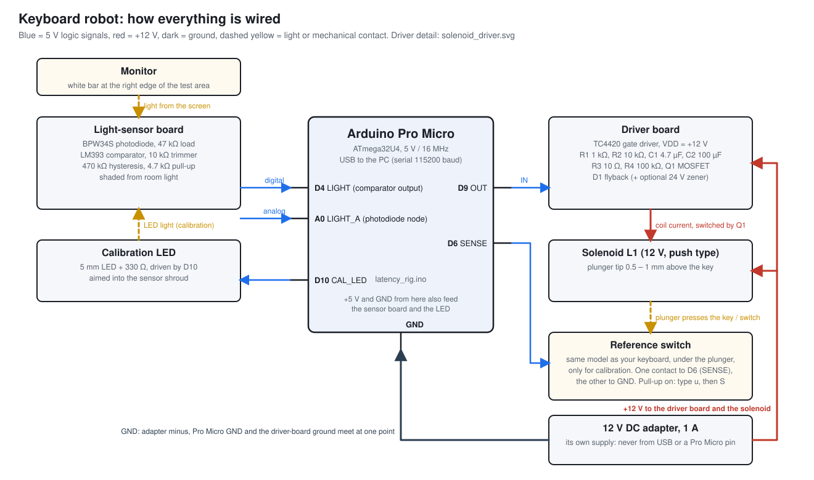
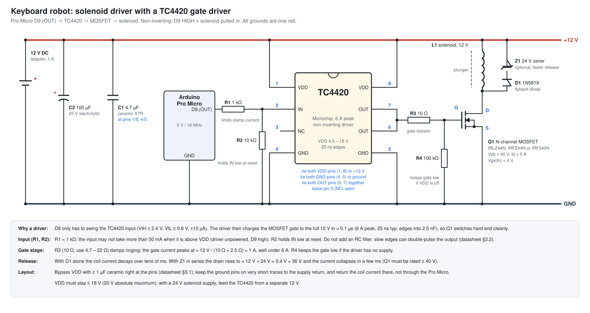

# Latency rig: build guide

An optional add-on that lets the app measure **input latency automatically** (a "robot" clicks the mouse or
presses a key the instant it sees the white bar on screen) and **display latency** (rise/fall time, refresh
period, click-to-photon). Everything here is built from common parts. The manual click/press test in the app
keeps working without any hardware.

Firmware: [`arduino/latency_rig/latency_rig.ino`](../../arduino/latency_rig/latency_rig.ino) (Arduino Pro
Micro / ATmega32U4, 5 V / 16 MHz).

> **Safety.** Never solder on a mouse or keyboard that is plugged in. The mouse button is a 3.3–5 V logic
> line, harmless, but keep the USB cable out while soldering. The solenoid runs from its own supply: never power
> it from a Pro Micro pin or from the USB 5 V rail (the TC4420 driver runs from that same 12 V rail; its limit is
> 18 V). Photodiode and comparator circuits are low-voltage only.
> If you build a mains-powered supply for the solenoid, use a ready-made certified adapter, not your own.

---

## 1. What each mode measures

| Mode | Command | What you get | What is *not* in the number |
|---|---|---|---|
| **Robot** (mouse or keyboard) | `r` (default) | Time from the white bar appearing on the sensor to the OS delivering the click/key to the app. Per trial: `T,n,detect_to_out_us,out_to_contact_us,out_to_response_us` | The robot's own delay, removed by calibration |
| **Calibrate robot** | `c` | `ROBOT_DELAY_MS` = LED→detect + detect→output + output→contact | (this *is* the robot delay) |
| **Display pattern** | `d` | On/off durations, period, frequency (= refresh rate if the pattern flips every frame), jitter of each edge | – |
| **Waveform** | `w` (rise) / `W` (fall) | 10 %→90 % rise/fall time of the panel (response time), 0.5–2 µs sampling | – |
| **Click-to-photon** | `l [n]` | Arduino sends **F13** over USB, the app flashes white on any key, sensor sees it. Trigger→light, `n` trials | ≈ 0–1 ms of USB polling wait is *inside* the number |

**Error budget of the robot** (mouse): photodiode + comparator 1–3 µs; sketch `detect_to_out_us` 1–4 µs;
BC550 switching a few µs; total well under 0.05 ms, so it is negligible next to the 1 ms frame quantisation of
the app (VSync is off by default so frames run unsynchronised and timestamps are ~1 ms apart at worst).
The keyboard robot is dominated by the solenoid (5–15 ms), which is why it must be calibrated.

Also keep in mind:

* The measured time **includes** the display (frame → light), the mouse's own firmware debounce/USB polling, the
  OS and the app. That is what a player experiences. Enable *"also subtract display delay"* in **Rig calibration**
  to see only the input stack.
* The bar is on the right 10 % of the area and spans the full height; a display scans out top to bottom, so put
  the sensor at the **same vertical position** every time (centre is a good default) and compare like with like.
* Shade the sensor from room light (a short piece of black heat-shrink, or a foam ring pressed against the
  glass) so black stays black.

---

## 2. Bill of materials

Everything is available on eBay/AliExpress/Mouser or in a normal electronics drawer.

**Core (mouse robot, display tests)**

| Qty | Part | Notes |
|---|---|---|
| 1 | Arduino **Pro Micro** (ATmega32U4, 5 V / 16 MHz) | Must be the 5 V/16 MHz version. Micro-USB. The 3.3 V/8 MHz one is half speed and will not work with this sketch |
| 1 | **BPW34S** photodiode (SMD; BPW34 through-hole is identical electrically) | Silicon PIN, ~100 ns rise; not an LDR (LDRs take 10–100 ms) |
| 1 | LM393 (dual comparator, DIP-8) | Or LM339 (quad) if you want the optional edge-pulse outputs |
| 1 | BC550 (or BC547/2N3904, any small NPN) | Mouse-button switch |
| resistors | 47 kΩ (sensor load), 4.7 kΩ ×2, 1 kΩ ×2, 470 kΩ (hysteresis), 10 kΩ ×2, 330 Ω | 1/4 W, 5 % is fine |
| 1 | 10 kΩ multi-turn trimmer | Comparator threshold |
| 1 | 5 mm LED (any colour, white best) + the 330 Ω | Calibration light source |
| – | breadboard / perfboard, hookup wire, Dupont leads, black heat-shrink | |
| – | thin enamelled/silicone wire (30 AWG) | To the mouse button pads |

**Keyboard robot (add)**

| Qty | Part | Notes |
|---|---|---|
| 1 | Push-type open-frame solenoid, 5–12 V, stroke 3–5 mm (e.g. "0520/0530" 12 V types) | Faster with a short stroke and light plunger |
| 1 | **TC4420** 6 A MOSFET gate driver, Microchip, DIP-8 (e.g. TC4420CPA / TC4420EPA) or SOIC-8 | Non-inverting, VDD 4.5–18 V. Same pinout in every package; see §6 |
| 1 | N-channel power MOSFET: **IRLZ44N**, IRFZ44N or IRF540N (Vds ≥ 40 V, Id ≥ 5 A, Vgs(th) < 4 V) | The driver gives it a full 12 V gate, so a logic-level part is no longer required |
| 1 | Flyback diode: 1N5819 or 1N4007 | Across the solenoid, cathode to +12 V |
| 1 | Optional 24 V zener, 1.3 W or more (BZX85C24 / 1N5359) in series with the flyback diode | Faster release (see §6) |
| 1 | **C1** 4.7 µF X7R ceramic, ≥ 25 V (optionally + 100 nF in parallel) | Right at the TC4420 supply pins (datasheet: at least 1 µF) |
| 1 | **C2** 100 µF / 25 V electrolytic | Bulk capacitor on the 12 V rail near the driver |
| 4 | **R1** 1 kΩ, **R2** 10 kΩ, **R3** 10 Ω, **R4** 100 kΩ | R1 limits the input clamp current, R2 input pull-down, R3 gate resistor, R4 gate pull-down |
| 1 | 12 V, 1 A DC adapter | Own supply, common ground |
| 1 | **Spare switch of the same type as your keyboard** (a loose Cherry MX / Gateron / Kailh) | Reference switch for calibration |
| – | Rubber/foam tip for the plunger, a rigid clamp/3D-printed bracket | Repeatable gap over the key |

---

## 3. Pro Micro pin map

The code uses AVR port bits directly, so the board package's pin numbering does not matter. The pin labels
printed on the Pro Micro are:

| Label | AVR pin | Name in sketch | Connect to |
|---|---|---|---|
| **D4** | PD4 (ICP1) | `LIGHT` | Comparator output (HIGH = white). Timer1 captures its edges |
| **A0** | PF7 (ADC7) | `LIGHT_A` | Analog photodiode node, 0–5 V (waveform mode) |
| **D9** | PB5 | `OUT` | → 1 kΩ → BC550 base (mouse) **or** → R1 1 kΩ → TC4420 pin 2 IN (solenoid driver) |
| **D6** | PD7 | `SENSE` | Contact feedback: mouse-button node via 10 kΩ, **or** the reference switch to GND |
| **D10** | PB6 | `CAL_LED` | → 330 Ω → LED aimed at the photodiode (calibration only) |
| VCC / GND | | | 5 V, ground |

If your comparator output is LOW for white, type `i` (toggles light polarity) and `S` (save).

---

## 4. Light-sensor front end

### 4.1 Photodiode + LM393 (recommended)

```
        +5V
         │
         ├───────────────┐
         │               │ K (cathode)
         │            ▶│ BPW34S  (reverse biased: cathode to +5 V; the flat/marked side is the cathode)
         │               │ A (anode)
         │               ├──────────────┬───────────────────► A0   (analog, waveform mode)
         │               │              │
         │              47k             │
         │               │              └──────► LM393 IN+ (pin 3)
        GND             GND                      LM393 IN− (pin 2) ◄── wiper of 10k trimmer (5 V ─ trimmer ─ GND)

   LM393 (+5 V pin 8, GND pin 4)
     OUT (pin 1) ──┬── 4.7k ── +5 V           hysteresis: 470k from OUT back to IN+
                   └───────────────────────► D4   (HIGH = light above threshold)
```

* Photocurrent from a monitor pressed against the sensor is tens of µA; 47 kΩ turns that into about 1–3 V for
  white and well under 0.1 V for black. RC = 47 kΩ × ~70 pF ≈ 3 µs, far faster than any panel.
* Set the trimmer with the white bar shown: turn it until D4 flips exactly when the bar changes; the middle
  of the range between the "white" and "black" voltages is best (measure the anode node with a multimeter).
* The 470 kΩ feedback gives ~0.2–0.4 V hysteresis so the output does not chatter during a slow fade.
  Use 1 MΩ for less, 220 kΩ for more.
* Bright rooms: increase shading, do not decrease the resistor; an LM393 input sees noise from sunlight and
  mains-powered lamps otherwise.
* If the panel is very bright and the node clips at 5 V, drop to 22 kΩ.

### 4.2 Discrete alternative: BC550 Schmitt trigger (no comparator IC)

Emitter-coupled Schmitt trigger. SPICE-simulated thresholds: **≈ 2.0 V rising, ≈ 1.2 V falling**, so put the
sensor node at roughly 0.3 V for black and 2.5 V+ for white (raise the 47 kΩ to 100 kΩ if it is not reaching
that).

```
   +5V ──┬────────────┬───────────┐
        2.2k Rc1     1k Rc2      │
         │            │
   sensor node ─1k Rin─ B1 Q1    Q2 collector ─────► D4  (HIGH = white)
                        C1 ──┬── 4.7k R1 ── Q2 base ──┬── 10k R2 ── GND
                             │                         
   Q1 emitter ───────┬────── Q2 emitter                
                    330 Re                        (both emitters join, one 330 Ω to GND)
                     │
                    GND
```

(Q1/Q2 = BC550. Q1 collector is the R1 tap, Q2 collector is the output.) It is slower to tune than the LM393
and drifts with temperature, but uses only parts from the drawer.

### 4.3 Edge-detect outputs (optional)

The sketch does **not** need an analog edge detector: Timer1's input capture timestamps *both* edges of D4 to
0.5 µs. If you would rather have pulse outputs (for a scope or a counter):

```
  sensor node ── 1 nF ──┬── 100k ── 2.5 V bias (2×10k divider, 5 V → GND)
                        │
                        ├── LM339 A: IN+ ; IN− = 2.5 V + 0.3 V  → pulse on a rising edge
                        └── LM339 B: IN− ; IN+ = 2.5 V − 0.3 V  → pulse on a falling edge
```

---

## 5. Mouse robot (BC550 across the button)

Open the mouse and find the switch under the button you want to test (left button).
A mechanical switch has two contacts; on most mice one side is ground (or a common that the MCU pulls low) and
the other goes to an MCU pin with a pull-up.

1. **Solder two thin wires** to the two switch pads (or to the two ends of the switch), not on the button itself
   so the button still works.
2. **Find the polarity** with a multimeter (DC volts) while the mouse is USB-powered and the switch is open:
   the pad that reads ~3 V is the *positive/signal* side, the other is the *ground* side. Unplug afterwards.
3. Wire:

```
   Mouse switch signal pad ──────────────► BC550 collector
   Mouse switch ground pad ──────┬───────► BC550 emitter
                                 └───────► Pro Micro GND
   Pro Micro D9 ── 1 kΩ ────────────────► BC550 base
   (optional, calibration) Pro Micro D6 ── 10 kΩ ── signal pad   → SENSE
```

   BC550 pinout (flat side facing you, leads down): **C – B – E** for the TO-92 BC550 (check the datasheet of
   your batch; several vendors use different orders).
4. The mouse pulls the signal pad up through its own resistor; when D9 goes high the transistor pulls the pad
   to ground exactly as a real click would. The 10 kΩ from SENSE lets the sketch see the electrical contact time
   for calibration (`out_to_contact_us`), and does not load the line.
5. Leave the internal SENSE pull-up **off** (default) for the mouse node.
6. If the mouse has a "floating" switch (neither side reads a stable voltage), use a **PC817 optocoupler**
   (LED via 1 kΩ from D9, phototransistor across the switch, turn-on ≈ 5–15 µs) or a **4066** analog switch instead
   of the BC550. A reed relay also works but adds ~0.5 ms.

### Fully analog mouse clicker (no microcontroller)

To remove the microcontroller from the loop, feed the comparator straight into the transistor:

```
   photodiode node ──► LM393 IN+ (same circuit as 4.1)
   LM393 OUT ── 4.7k ── +5 V
   LM393 OUT ── 1 kΩ ── BC550 base      BC550 collector/emitter across the mouse switch as above
   5 V supply from any USB charger, GND shared with the mouse ground pad
```

White → output high (via the pull-up) → transistor on → click; black → click released. The whole reaction is
one comparator (~1.3 µs) plus the transistor. You still measure in the app, which times from the frame it
drew, so the only calibration term is the display's frame→light time (see §7). Hysteresis (470 kΩ) prevents
double clicks while the light fades.

---

## 6. Keyboard robot (solenoid + TC4420 driver)



### 6.1 Why a TC4420

The solenoid is switched by an N-channel MOSFET. **Do not drive the MOSFET gate straight from the Pro Micro pin;
put a Microchip TC4420 between them.** The TC4420 is a single-output, non-inverting, **6 A peak** MOSFET gate driver
(4.5–18 V supply, TTL/CMOS input), so `D9` HIGH still means "solenoid on" and the firmware does not change.

| | Pin → 100 Ω → gate (old design) | Pin → TC4420 → gate (recommended) |
|---|---|---|
| Load on the Pro Micro pin | 5 V into ≈ 100–125 Ω = 40–50 mA at every edge, at or above the ATmega32U4's 40 mA per-pin limit | microamps (input current ±10 µA) |
| Gate voltage | 5 V: needs a logic-level MOSFET, only partly enhanced | the full 12 V: any standard MOSFET, lowest Rds(on) |
| Gate edge | ≈ 1 µs (about 50 nC at 40 mA) | ≈ 0.1 µs (6 A peak; 25 ns typical rise/fall into 2.5 nF) |
| Extra parts | none | TC4420, two capacitors, three resistors |

Be realistic about the gain: the solenoid's mechanical delay (5–15 ms) dominates the keyboard robot, so the driver does not
shave milliseconds off it. What it gives you is a clean, repeatable switching instant, a protected microcontroller pin
and freedom in the choice of MOSFET (or a larger solenoid). Calibration (§7) absorbs the remaining delay as before.

What the datasheet (Microchip DS21933B, TC4420M/TC4429M) guarantees, and what the design uses:

| Datasheet item | Value | Used for |
|---|---|---|
| Peak output current | 6 A | 10 Ω gate resistor is enough, ≈ 1 A peak |
| Supply (VDD) | 4.5 – 18 V, 20 V absolute maximum | fed from the 12 V rail |
| Input thresholds | VIH ≥ 2.4 V, VIL ≤ 0.8 V, input current ±10 µA | driven straight from a 5 V pin |
| Input voltage range | −5 V … VDD + 0.3 V; **input current ≤ 50 mA when VIN > VDD** | R1 = 1 kΩ (5 V / 1 kΩ = 5 mA) |
| Rise / fall / delay | 25 ns / 25 ns / 55 ns typical (35 / 35 / 75 max), 2.5 nF load | gate edge ≈ 0.1 µs |
| Output resistance | 1.5 Ω (low) to 2.1 Ω (high) typical | gate current = 12 V / (10 Ω + ≈ 2.5 Ω) |
| Supply current | 0.45 mA typical with input high, 55 µA with input low | negligible |
| Latch-up | withstands > 1.5 A reverse output current | no clamp diodes needed at the output |
| Input edges | has a speed-up capacitor: **slow input edges can double-pulse the output** | no RC filter on IN, R1 stays small |
| Bypass | local ceramic capacitor on VDD, at least 1 µF | C1 = 4.7 µF X7R at the pins |
| Pins | **duplicate pins must both be connected** | tie 1 + 8, 4 + 5, 6 + 7; pin 3 is NC |

DS21933B covers the **TC4420M** (−55 … +125 °C, CERDIP). For this build buy the ordinary commercial or industrial
TC4420 in DIP-8 or SOIC-8 (the ordering codes are in Microchip's TC4420/TC4429 datasheet DS21419, which the M datasheet
points to): it is the same 6 A, 4.5–18 V driver with the same pinout. Do not buy the **TC4429**: it is the inverting
version and the robot would fire while the sensor is dark.

### 6.2 Schematic



The same circuit as text, plus the exact connections (TC4420 in DIP-8, pin numbers as on the chip):

```
                     TC4420
                  ┌───────────┐
   +12 V ── 1 VDD│           │VDD 8 ── +12 V
                  │           │
 D9 ─ R1 1k ─┬── 2 IN         OUT 7 ─┬─ R3 10 Ω ─┬─ gate ┐
             │   │           │       │           │       │  Q1  N-channel MOSFET
             │  3 NC         OUT 6 ─┘          R4 100k   │  drain ── L1 solenoid ── +12 V
            R2 10k│           │                   │      │  source ── GND
             │  4 GND        GND 5               GND     ┘
            GND   └───────────┘                          D1 across L1: anode = drain, cathode = +12 V
                   (4, 5 → GND)                          (optional Z1 in series with D1, see below)
```

| Connection | Goes to |
|---|---|
| Pro Micro `D9` | R1 (1 kΩ) → TC4420 pin 2; that node also through R2 (10 kΩ) to GND |
| TC4420 pins 1 **and** 8 | +12 V; C1 (4.7 µF) and C2 (100 µF) from +12 V to GND right there |
| TC4420 pins 4 **and** 5 | GND (short wire to the adapter minus) |
| TC4420 pins 6 **and** 7 | tied together → R3 (10 Ω) → Q1 gate; R4 (100 kΩ) from the gate to GND |
| TC4420 pin 3 | not connected |
| Q1 source | GND |
| Q1 drain | one solenoid terminal and D1 anode |
| Solenoid other terminal | +12 V |
| D1 cathode | +12 V (or Z1 cathode, with Z1 anode to +12 V) |

* Tie **both** VDD pins (1 and 8) to +12 V, **both** GND pins (4 and 5) to ground and **both** OUT pins (6 and 7)
  together. Pin 3 is not connected.
* D1 conducts only when the MOSFET turns off: its anode goes to the drain, its cathode to +12 V (banded end up). With the
  optional zener (Z1) the cathode of D1 goes to the cathode of Z1 and the anode of Z1 to +12 V.
* Put **C1 (4.7 µF ceramic) as close as you can to pins 1/8 and 4/5**, and keep the short loop TC4420 → R3 → gate →
  source → ground pin tight (a few centimetres). The ground pins must have very short traces or wires to the supply
  return (datasheet §3.4): return the coil current there, not through the Pro Micro's ground lead.
* **Faster release:** put a 24 V zener *in series with the flyback diode* (diode + zener across the coil). The coil
  current then collapses in a few ms instead of tens of ms; the MOSFET sees 12 V + 24 V + 0.4 V ≈ 36 V, inside the
  55 V rating of the IRLZ44N / IRFZ44N (IRF540N: 100 V).
* **Supply above 18 V:** the TC4420's VDD must stay ≤ 18 V (20 V absolute maximum). With a 24 V solenoid supply, feed pins
  1 and 8 from a separate 12 V source (for example a 7812 regulator from the 24 V rail) and keep all grounds common; with the
  zener the drain then sees 24 V + 24 V, so use a 100 V MOSFET (IRF540N).
* **Overdrive:** a 12 V coil rated 5 V pulls in about twice as fast; the sketch's `M<ms>` (default **300 ms**) hard-limits
  how long the output may stay on so the coil cannot burn out if something hangs. Lower it: `M50`, then `S`.
* R2 keeps the driver input low while the Pro Micro resets or is being programmed, so the solenoid cannot fire at
  power-up. R4 keeps the gate low if the driver ever has no supply. Do not put a capacitor or RC filter on the input.
* Mount the solenoid on a bracket so the plunger sits **~0.5–1 mm above the keycap** with a foam/rubber tip,
  pressing the key straight down; a repeatable gap matters more than raw power.
* Use a key that does nothing harmful (Scroll Lock, F13). The app's press test accepts any key.

### 6.3 Bring-up in five steps (before the solenoid is connected)

1. Build the driver board **without the solenoid and MOSFET**. Power it from the 12 V adapter with the Pro Micro on USB and
   the grounds joined. Measure pin 1/8 = 12 V and pin 6/7 = 0 V (D9 is low, R2 holds the input low).
2. Flash the sketch and type `c` with the CAL LED aimed at the photodiode. Every calibration trial pulses D9: on a scope or
   a multimeter with min/max hold, pin 6/7 swings between 0 V and ≈ 12 V and the input (pin 2) between 0 V and 5 V.
3. Fit R3, R4 and the MOSFET. With **no solenoid connected**, the gate (measured to ground) now follows the pulses, and the
   MOSFET drain sits at 12 V or near 0 V depending on what you connect as a test load (for example a 12 V lamp).
4. Fit D1 (and Z1). Check the polarity twice: with the coil connected, the diode must be reverse-biased while the MOSFET
   is on.
5. Connect the solenoid, run `c` again and read `ROBOT_DELAY_MS`; typical 5–15 ms (§7). If the driver or the MOSFET runs
   warm, check the gate resistor and the ground return first.

### Reference switch (used for calibration)

Fit a loose switch of the same model as your keyboard under the same plunger position and wire it between **D6
(SENSE)** and **GND** with the internal pull-up enabled (`u`, then `S`). During calibration the plunger presses this
switch and the sketch measures output → closed contact. For the keyboard, the real actuation point is the switch
contact, so this is the same mechanical delay the robot adds to a real key press.

---

## 7. Calibration procedure

Do this once per robot (and again after moving the bracket, the sensor or changing the solenoid supply).

1. Flash the sketch (Arduino IDE → Board **Arduino Leonardo** → Port → Upload). Open the serial monitor,
   **115200 baud, "Newline"**, type `h`.
2. Aim the **CAL LED (D10)** at the photodiode (LED shining into the shroud). With the display showing black,
   tune the comparator so D4 is low with the LED off.
3. Mouse: connect SENSE (10 kΩ) to the mouse switch node. Keyboard: put the reference switch under the plunger.
4. Type **`c`**. It runs 40 trials and prints the median:
   `CAL led_to_detect_us=… detect_to_out_us=… out_to_contact_us=…` and `ROBOT_DELAY_MS=x.xxx`.
   Because the LED is a fast (µs) light source, `led_to_detect_us` is the sensor+comparator delay.
5. In the app: **Input tab → Rig calibration → Mouse robot** (or **Keyboard robot**), enter `ROBOT_DELAY_MS`,
   press **Save** (stored next to the exe as `rig_calibration.json`).
6. **Display (frame → light):** run the `l` command with the app in *Display patterns → "Flash when the
   Arduino sends F13"*; take the median trigger→light. It includes ≈0–1 ms (average 0.5 ms) of USB polling, so
   subtract about 0.5 ms; enter it as **Display (frame → light)**. Treat this as ±0.5 ms accurate.
7. In **Rig calibration**, tick *subtract robot delay* (and *also subtract display delay* if you want only the
   input stack). Only automated-rig runs are corrected; manual runs never are.

Typical values: mouse robot 0.02–0.05 ms, keyboard robot 5–15 ms, depending on solenoid and supply.

---

## 8. Display-latency workflows

**Refresh rate / frame pacing (`d`).** In the app: *Input tab → Display patterns → square wave, flip every
frame*. Put the sensor on the pattern and type `d`. The sketch prints on/off durations, the period and the
frequency. With the app running at the display's refresh rate the period is exactly one frame pair, so
`frequency` is the refresh rate. Jitter shows dropped or late frames. Use `--vsync` when starting the app to
present at the refresh rate.

**Response time (`w` / `W`).** Show the pattern with a full white ↔ black flip; type `w` to capture the next rising
edge (or `W` for the next falling edge). The sketch prints the 10 %→90 % time. For panels with overdrive this is
pixel-response time, and different grey levels give different results.

**Click-to-photon (`l`).** *Display patterns → "Flash when the Arduino sends F13"*. Type `l 20`. Each trial
prints trigger→light. This is a poor man's LDAT: it includes USB, OS, the app and the display, but not a mouse.

---

## 9. Troubleshooting

| Symptom | Fix |
|---|---|
| Robot never fires | Trimmer too high/low; check D4 with a multimeter while toggling the bar; type `i` if the output is inverted |
| Fires on black, clicks constantly | Threshold below the black level → raise the trimmer, shade the sensor |
| `CAL: sensor did not see the LED` | LED not aimed at the sensor or threshold too high |
| `SENSE never went low` | Check the 10 kΩ / pull-up setting (`u` toggles it): pull-up **on** for a reference switch to GND, **off** for the mouse node |
| Double clicks | Increase hysteresis, `H<ms>` (minimum hold) and `R<ms>` (re-arm) then `S` |
| Solenoid too slow / weak | Raise the supply, shorten the gap, use the zener release, add a lighter plunger tip |
| Solenoid twitches at power-up or while uploading | R2 (10 kΩ, TC4420 pin 2 to ground) missing, or the TC4420 supply is up before the Pro Micro pin state is defined |
| Solenoid fires twice per trial | Something slows the driver input (an RC filter, a long thin wire): the TC4420 double-pulses on slow edges; drive pin 2 through R1 only |
| TC4420 runs hot or the output rings | C1 not at pins 1/8 and 4/5, long ground return, R3 too small (use 10 – 22 Ω), or the MOSFET gate is oscillating |
| Nothing happens at the solenoid | Pins 1 **and** 8 to +12 V, pins 4 **and** 5 to ground, pins 6 **and** 7 to R3 (the datasheet: duplicate pins must both be connected); MOSFET pin order (G-D-S varies) |
| Serial monitor shows nothing | 115200 baud, "Newline"; the Pro Micro's serial port re-appears after a reset |

---

## 10. Testing the software side

No hardware is needed to check the firmware logic:

```bash
# host tests for the statistics/edge maths
g++ -std=c++11 -Wall -o /tmp/t arduino/tests/test_analysis.cpp && /tmp/t

# full firmware in the simavr AVR simulator (robot timing, calibration)
# build the .elf with avr-gcc against the Leonardo core, then:
gcc -O2 -o sim_robot arduino/tests/sim_robot.c -lsimavr -lelf && ./sim_robot rig.elf
```
